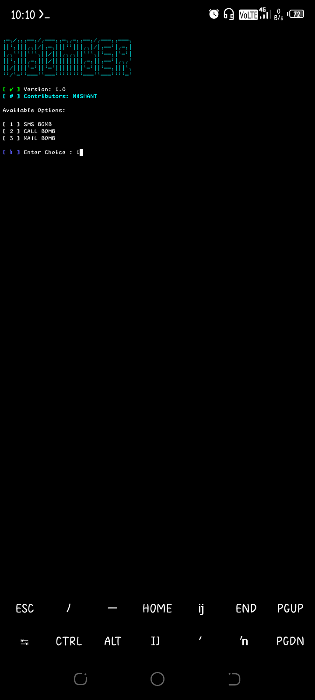
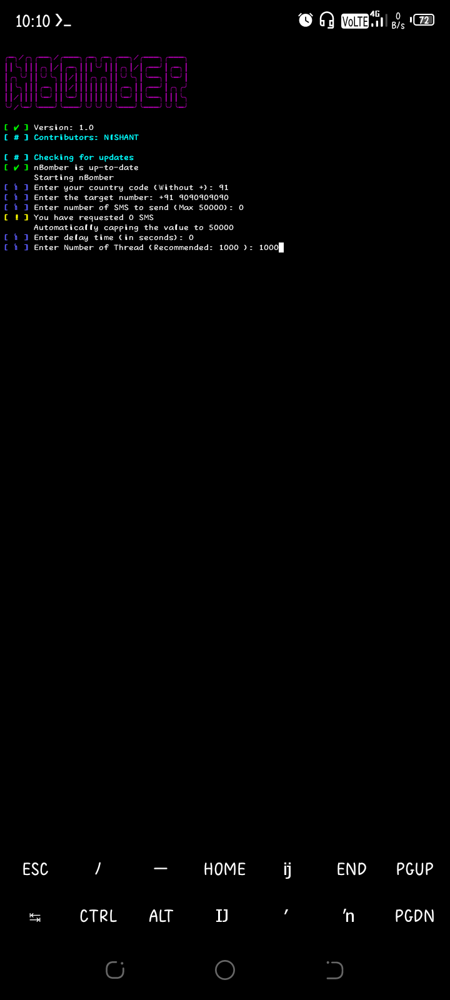
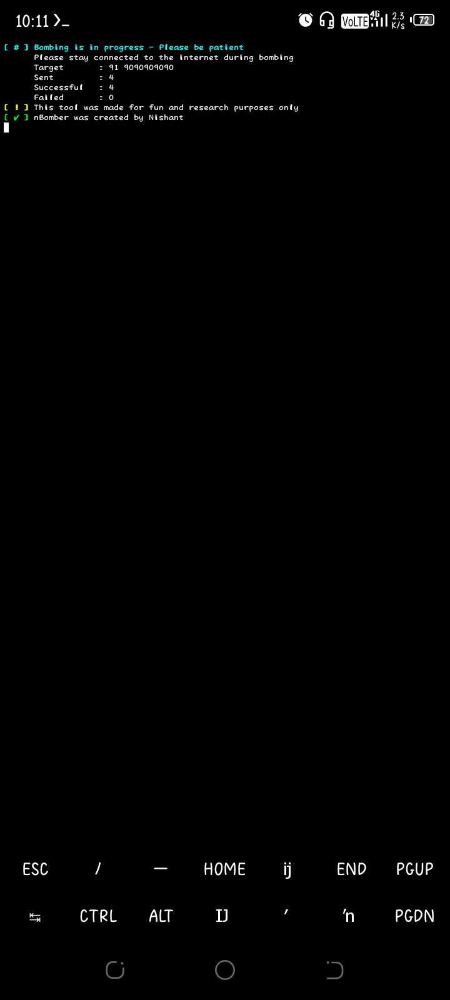

# Bomber
SMS BOMBING TOOL WITH HAVING 50,000 MESSAGE SENDING CAPACITY AT A TIME.

<h2 align="center"><u>Bomber</u></h2>

<p align="center">A free and open-source SMS/Call bombing application</p>

<p align="center">
<br>
</p>








### [+] Description
> **SMS BOMBING TOOL WITH HAVING 50,000 MESSAGE SENDING CAPACITY AT A TIME.**

•The application requires active internet connection to contact the APIs

•You would not be charged for any SMS/calls dispatched as a consequence of this script

•For best performance, use single thread with considerable delay time.

•Always ensure that you are using the latest version of Bomber and have Python 3.

•This application must not be used to cause harm/discomfort/trouble to others.

•By using this, you agree that you cannot hold the contributors responsible for any misuse.

### [+] Installation
Run these commands to Install Bomber.

```shell script
git clone https://github.com/Nishant2009/Bomber 
cd Bomber
pip install bomber-1.0-py3-none-any.whl --force-reinstall
cd .. 
rm -rf Bomber
```

## [+] USAGE

To use the bomber type the following commands:
```shell script
bomber
```

## FAQ
**Q:** Poor Internet Connection Detected:

**A:** Here are a few stuff you can try:
- Check your connection.
- Make sure `openssl` is installed.
- Try to `ping` any remote site/address to be sure.
- Try to reinstall if nothing works.
##
**Q:** How many COUNTRIES do you support?

**A:** Most Countries are supported for SMS and only India for calls. The SMS delivery rate might be different for different countries.
##
**Q:** How many COUNTRIES Do you support ?

**A:** Most Countries are supported for SMS and only India for calls. The SMS delivery rate might be different for different countries.
##
**Q:** How to get protection ?

**A:** Use OTP blockers and activate DND.
##
